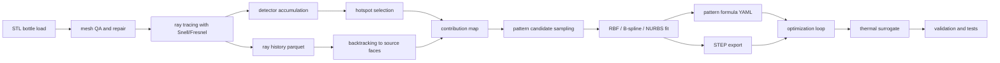

# PET 병 집광 억제 시뮬레이션 파이프라인 개발을 위한 오픈소스 코드·라이브러리·문서 조사 보고서

## 집행 요약

이 프로젝트의 목적이 **STL 기반 3D 병 형상 위에 패턴을 입히고**, **광선 추적 → contribution-map → 패턴 생성 → 최적화 → 열위험 평가 → 수식/STEP 내보내기**까지 하나의 연구 파이프라인으로 연결하는 것이라면, 가장 실용적인 기본 조합은 **Open3D + trimesh + 사용자 정의 Snell/Fresnel + pandas/Parquet + SciPy**입니다. Open3D의 `RaycastingScene`은 가속구조를 가진 ray intersection / closest-point 질의를 제공하고, CPU와 SYCL GPU를 지원하며, 교차 결과로 `t_hit`, `geometry_ids`, `primitive_ids`, `primitive_uvs`, `primitive_normals`를 돌려주므로 per-ray history와 hotspot backtracking의 출발점으로 적합합니다. trimesh는 watertight surface 중심의 mesh 처리, ray intersector, proximity query를 제공해 STL 전처리와 geometry QA를 맡기 좋습니다.

검증 계층은 별도로 두는 것이 좋습니다. **Raysect**는 과학용 ray tracing을 목표로 한 Python 프레임워크로, fully spectral observer/pipeline 구조가 강하고, **Mitsuba 3**는 Python에서 custom renderer와 vectorized BSDF 계산을 지원하며, scalar / llvm / cuda variant를 선택할 수 있어 고충실도 광학 검증에 적합합니다. 반면 **pbrt-v4**와 **POV-Ray**는 “주 개발 엔진”보다는 물리적으로 타당한 reference / sanity check / 알고리즘 비교용으로 두는 것이 낫습니다.

패턴 생성은 **contribution-map 기반 후보 영역 선정 → blue-noise/Poisson-disk 또는 QMC 샘플링 → RBF/B-spline/NURBS 근사 → STEP 내보내기**가 가장 연구 논리와 공정 연결성이 좋습니다. SciPy는 `PoissonDisk`, `Sobol`, `Halton`, `RBFInterpolator`, `bisplrep`, `BSpline`을 제공하고, geomdl은 NURBS/B-spline geometry 표현과 fitting 예제를 제공하며, CadQuery는 STEP export를 직접 지원합니다.

실험 관리 계층은 **Optuna 또는 Nevergrad + MLflow + SALib + SciPy `solve_ivp`**가 가장 안정적입니다. Optuna는 study/RDB 기반 최적화와 ask-and-tell, multi-objective 레시피를 제공하고, Nevergrad는 gradient-free mixed/discrete parameter optimization에 강하며, MLflow Tracking은 parameter / metric / code version / artifact를 UI와 API로 로깅하고, SALib는 Sobol/Morris/FAST 계열 민감도 분석을 표준화합니다. 열모델은 연구 초기에 lumped thermal model로 시작하고, hotspot이 아주 작거나 재료/두께 방향 gradient가 중요해지면 multi-lump 또는 PDE로 넘어가는 전략이 적절합니다.

라이선스 측면에서는 **PyMeshLab이 GPL**, **Blender가 GPL**, **Open3D와 trimesh가 MIT**, **Raysect가 BSD-3-Clause**, **pbrt-v4와 CadQuery·MLflow가 Apache-2.0**, **geomdl·Optuna·SALib가 MIT**, **Mitsuba 3는 BSD 계열로 선언**되어 있어, 배포 정책이 민감하다면 PyMeshLab/Blender는 코어 런타임 의존성보다 선택적 전처리 도구로 분리해 두는 편이 보수적입니다.

## 코어 스택 권고

### 광선 추적과 교차 연산

**Open3D**는 이 프로젝트의 1순위 개발 엔진입니다. `RaycastingScene`은 triangle mesh 대상 ray intersection과 closest-point query를 지원하고, 내부 가속 구조를 사용하며, CPU와 SYCL GPU에서 동작합니다. 특히 교차 결과에 triangle id와 barycentric uv, triangle normal이 포함되어 있어, detector hotspot을 다시 bottle face로 역매핑하는 contribution-map 단계에 직접 연결할 수 있습니다. 라이선스는 MIT입니다.
`URL: https://www.open3d.org/docs/latest/python_api/open3d.t.geometry.RaycastingScene.html`
`URL: https://www.open3d.org/docs/latest/tutorial/geometry/ray_casting.html`
`URL: https://github.com/isl-org/Open3D`

**trimesh**는 STL/mesh 처리의 1순위 보조 라이브러리입니다. 공식 문서는 watertight surface 중심의 triangular mesh 처리 라이브러리라고 설명하고, `RayMeshIntersector`는 first-hit, multiple-hit, location 반환 메서드를 제공하며, `ProximityQuery`는 closest point, signed distance, thickness 같은 분석 기능을 제공합니다. 광선 엔진으로는 Open3D를 쓰고, geometry QA·mesh repair·distance/thickness 계산에는 trimesh를 쓰는 조합이 가장 현실적입니다. 라이선스는 MIT입니다.
`URL: https://trimesh.org/`
`URL: https://trimesh.org/ray.html`
`URL: https://trimesh.org/trimesh.ray.ray_triangle.html`
`URL: https://trimesh.org/trimesh.proximity.html`
`URL: https://github.com/mikedh/trimesh`

**Raysect**는 validation 계층에서 매우 유용합니다. 공식 문서는 Raysect를 scientific ray tracing 지향의 OOP Python framework라고 소개하며, fully spectral / high precision / Cython core loops를 강조합니다. `World`는 기본적으로 kd-tree 가속 구조를 유지하고, `hit()`는 intersection을 반환하며, 같은 primitive에 대해 `next_intersection()`을 반복 호출할 수 있습니다. observer/pipeline 계층은 2D spectral power/radiance accumulation을 기본 구성요소로 제공하므로 detector accumulation reference로 매우 좋습니다. 라이선스는 BSD-3-Clause입니다.
`URL: https://www.raysect.org/`
`URL: https://www.raysect.org/api_reference/core/raysect_core_scenegraph.html`
`URL: https://www.raysect.org/api_reference/optical/observers.html`
`URL: https://www.raysect.org/api_reference/optical/pipelines.html`
`URL: https://github.com/raysect/source`

**Mitsuba 3**는 high-fidelity 광학 검증용으로 가장 강력한 후보입니다. 공식 문서는 pip 설치를 지원하고, `scalar`, `llvm`, `cuda` variant를 통해 CPU 단일-ray debugging부터 대규모 vectorized Python prototype까지 지원한다고 설명합니다. Python에서 custom renderer를 작성해 ray wavefront를 직접 생성할 수 있고, BSDF deep-dive 튜토리얼은 BSDF 객체를 Python dict로 만들고 vectorized evaluation하는 방법을 보여줍니다. sensors+films 구조는 radiance measurement 저장, detector/film 역할 분리를 명확히 정의합니다. 라이선스 표기는 BSD 계열입니다.
`URL: https://mitsuba.readthedocs.io/`
`URL: https://mitsuba.readthedocs.io/en/stable/src/rendering/scripting_renderer.html`
`URL: https://mitsuba.readthedocs.io/en/stable/src/others/bsdf_deep_dive.html`
`URL: https://mitsuba.readthedocs.io/en/stable/src/generated/plugins_sensors.html`
`URL: https://mitsuba.readthedocs.io/en/stable/src/generated/plugins_films.html`
`URL: https://github.com/mitsuba-renderer/mitsuba3`
`URL: https://github.com/mitsuba-renderer/mitsuba-tutorials`

**pbrt-v4**는 구현 참조와 회귀 검증용으로 좋습니다. 공식 저장소는 spectral rendering, GPU(OptiX/CUDA) 경로, physically tied BxDF/material redesign, GBufferFilm, increased unit test coverage 등을 명시하고 있습니다. 다만 Python-first STL workflow나 per-ray history 투명성은 Open3D/trimesh보다 불편하므로, “교차·기하 실험용”보다는 “광학 reference baseline”으로 쓰는 편이 낫습니다. 라이선스는 Apache-2.0입니다.
`URL: https://github.com/mmp/pbrt-v4`
`URL: https://pbrt.org/users-guide-v4`

**POV-Ray**는 backward ray tracing의 개념과 반사·굴절 ray 생성 논리를 설명하는 reference로 적합합니다. 공식 문서는 카메라에서 viewing ray를 쏘고, shadow ray와 reflected/refracted ray를 추가로 추적하는 고전적 설명을 제공합니다. 다만 STL 기반 연구 파이프라인의 주 개발 엔진으로는 Python API 유연성이 상대적으로 부족합니다.
`URL: https://www.povray.org/`
`URL: https://www.povray.org/documentation/view/3.60/4/`

### STL 전처리와 메쉬 보정

**PyMeshLab**은 대규모 triangle mesh 전처리·필터링에 유용합니다. 공식 문서에 따르면 `MeshSet`으로 mesh를 로드/저장하고 MeshLab filter를 적용할 수 있으며, filter list에는 subdivision, boolean union/intersection, 다양한 camera/transform/filter 파라미터가 명시되어 있습니다. 즉, 실험용 patterned STL 생성 전에 remeshing, boolean op, subdivision, decimation을 배치 전처리하기 좋습니다. 다만 GPL이므로 코어 런타임 의존성인지 선택적 전처리 도구인지 아키텍처를 구분하는 것이 좋습니다.
`URL: https://pymeshlab.readthedocs.io/`
`URL: https://pymeshlab.readthedocs.io/en/latest/intro.html`
`URL: https://pymeshlab.readthedocs.io/en/latest/filter_list.html`
`URL: https://github.com/cnr-isti-vclab/PyMeshLab`

**Blender + bpy/bmesh**는 “패턴을 STL 면 위에 실제로 감아 넣는” 단계에서 매우 실용적입니다. Blender Python API 문서는 `bmesh`로 editable mesh에 접근하는 방법을 제공하고, 공식 매뉴얼은 STL import/export를 지원한다고 설명합니다. Blender는 GPL이지만, 한국어 공식 매뉴얼과 한국어 STL 문서가 있어 팀 문서화와 공정 협업 환경에서 장점이 있습니다.
`URL: https://docs.blender.org/api/current/bmesh.html`
`URL: https://docs.blender.org/manual/en/latest/files/import_export/stl.html`
`URL: https://docs.blender.org/manual/ko/3.6/addons/import_export/mesh_stl.html`
`URL: https://docs.blender.org/manual/ko/latest/`
`URL: https://www.blender.org/about/license/`

### Snell·Fresnel·BSDF·BTDF·Detector 참조

Snell/Fresnel 구현의 1차 참조 문서는 **Mitsuba 3 polarization / dielectric** 문서가 가장 강합니다. polarization 문서는 Fresnel reflection amplitude 식과 Snell law를 명시적으로 적고 있고, `dielectric.cpp`는 smooth dielectric interface에서 Fresnel 기반 reflection/transmission 선택을 구현합니다. 더 중요한 것은 PET / water / air IOR preset이 공식 코드/문서에 포함되어 있다는 점으로, PET 1.575, water 1.3330, air 1.00028을 바로 검증용 baseline으로 쓸 수 있습니다.

BTDF/BSDF 추정의 경우, “정답 분포”는 **Mitsuba BSDF deep-dive와 dielectric/roughdielectric plugin**을 기준으로 삼고, 실제 프로젝트에서는 **custom tracer의 exit-direction histogram**으로 empirical BTDF를 만드는 이중 구조를 권장합니다. Mitsuba는 Python dict로 BSDF 객체를 구성해 distribution function을 그릴 수 있고, sensor+film 문서는 radiance measurement와 film 저장 형식을 명확히 정의합니다. Raysect는 observer/pipeline 구조로 2D spectral power/radiance accumulation을 기본 제공하므로 detector 기준 구현으로 참조하기 좋습니다.

### 예제 저장소와 공식 예제 링크

예제 레포지토리는 **Mitsuba tutorials**, **Raysect demonstrations**, **geomdl-examples**, **SALib sobol example**, **CadQuery examples**를 우선 수집해 두는 것이 좋습니다. Mitsuba tutorials는 공식 Jupyter notebook 모음이고, Raysect에는 Cornell box camera demo가 있으며, geomdl-examples는 fitting / exchange / surface / volume 예제를 묶어 둡니다. SALib는 공식 sobol example script에서 sample→evaluate→analyze 흐름을 그대로 제공합니다.
`URL: https://github.com/mitsuba-renderer/mitsuba-tutorials`
`URL: https://www.raysect.org/demonstrations/observers/cornell_box_with_camera.html`
`URL: https://github.com/orbingol/geomdl-examples`
`URL: https://github.com/SALib/SALib/blob/main/examples/sobol/sobol.py`
`URL: https://cadquery.readthedocs.io/en/latest/examples.html`

## 최소 코드 패턴

아래 코드는 “바로 제품 코드로 쓰기 위한 완성본”이 아니라, 공식 API와 문서 흐름을 따라 **핵심 메커니즘만 최소화한 참고 뼈대**입니다. Open3D는 hit distance / face id / barycentric uv / normal을 반환하고, pandas/Parquet은 columnar ray-history 저장에 적합하며, PyArrow는 Pandas의 parquet backend를 뒷받침합니다.

### ray–mesh intersection

```python
import numpy as np
import trimesh
import open3d as o3d

# 1) STL 로드: trimesh를 파일 I/O 전담으로 사용
tm = trimesh.load("data/sample/bottle_tiny.stl", force="mesh")

# 2) Open3D tensor mesh로 변환
v = o3d.core.Tensor(np.asarray(tm.vertices), dtype=o3d.core.Dtype.Float32)
f = o3d.core.Tensor(np.asarray(tm.faces), dtype=o3d.core.Dtype.UInt32)
mesh = o3d.t.geometry.TriangleMesh(v, f)

# 3) RaycastingScene 구성
scene = o3d.t.geometry.RaycastingScene()
scene.add_triangles(mesh)

# 각 ray = [ox, oy, oz, dx, dy, dz]
rays = o3d.core.Tensor(
    [
        [0.0, 0.0, 80.0, 0.0, 0.0, -1.0],
        [5.0, 0.0, 80.0, 0.0, 0.0, -1.0],
    ],
    dtype=o3d.core.Dtype.Float32,
)

hits = scene.cast_rays(rays)

print("t_hit =", hits["t_hit"].numpy())
print("geometry_ids =", hits["geometry_ids"].numpy())
print("primitive_ids =", hits["primitive_ids"].numpy())
print("primitive_uvs =", hits["primitive_uvs"].numpy())
print("primitive_normals =", hits["primitive_normals"].numpy())
```

이 패턴은 “다음 교차점 하나만 알려 주는 kernel”로 생각하면 됩니다. PET 외벽 → PET 내벽 → 물 경계 → 다시 외벽처럼 다중 경로가 필요할 때는, hit 지점에서 아주 작은 epsilon만큼 이동한 뒤 굴절된 새 direction으로 `cast_rays()`를 반복 호출하면 됩니다. Open3D가 geometry kernel을 맡고, Fresnel·medium state·ray termination은 사용자 코드가 맡는 구조가 가장 투명합니다.

### Snell refraction + Fresnel

```python
import numpy as np

def normalize(v: np.ndarray) -> np.ndarray:
    n = np.linalg.norm(v)
    if n == 0:
        raise ValueError("zero-length vector")
    return v / n

def refract_and_fresnel(wi, n, eta_i, eta_t):
    """
    wi: incident direction (toward surface), normalized
    n : geometric normal pointing from exterior to interior, normalized
    returns: (wo, R, T, tir)
    """
    wi = normalize(np.asarray(wi, dtype=float))
    n = normalize(np.asarray(n, dtype=float))

    cos_i = -np.dot(wi, n)

    # back-face hit이면 normal과 media swap
    if cos_i < 0:
        n = -n
        cos_i = -np.dot(wi, n)
        eta_i, eta_t = eta_t, eta_i

    eta = eta_i / eta_t
    sin2_t = eta**2 * max(0.0, 1.0 - cos_i**2)

    # Total internal reflection
    if sin2_t > 1.0:
        return None, 1.0, 0.0, True

    cos_t = np.sqrt(max(0.0, 1.0 - sin2_t))
    wo = eta * wi + (eta * cos_i - cos_t) * n
    wo = normalize(wo)

    # unpolarized Fresnel reflectance
    rs = ((eta_i * cos_i - eta_t * cos_t) / (eta_i * cos_i + eta_t * cos_t)) ** 2
    rp = ((eta_t * cos_i - eta_i * cos_t) / (eta_t * cos_i + eta_i * cos_t)) ** 2
    R = 0.5 * (rs + rp)
    T = 1.0 - R
    return wo, R, T, False

# 예시: air -> PET
wo, R, T, tir = refract_and_fresnel(
    wi=np.array([0.2, 0.0, -0.98]),
    n=np.array([0.0, 0.0, 1.0]),
    eta_i=1.00028,  # air
    eta_t=1.575,    # PET
)
print(wo, R, T, tir)
```

이 구현은 Mitsuba 문서의 Fresnel 식과 dielectric interface 모델을 연구용 Python 형태로 정리한 것입니다. PET / air / water 기본 굴절률 검증에는 Mitsuba dielectric preset 값을 그대로 참조하면 좋습니다.

### ray history logging

```python
import pandas as pd
import numpy as np

records = []

def log_surface_hit(ray_id, depth, face_id, point, normal, eta_i, eta_t, R, T, power_w):
    records.append({
        "ray_id": int(ray_id),
        "depth": int(depth),
        "event": "surface_hit",
        "face_id": int(face_id),
        "x": float(point[0]), "y": float(point[1]), "z": float(point[2]),
        "nx": float(normal[0]), "ny": float(normal[1]), "nz": float(normal[2]),
        "eta_i": float(eta_i), "eta_t": float(eta_t),
        "fresnel_R": float(R), "fresnel_T": float(T),
        "power_W": float(power_w),
    })

def log_detector_hit(ray_id, depth, px, py, power_w, source_face_id):
    records.append({
        "ray_id": int(ray_id),
        "depth": int(depth),
        "event": "detector_hit",
        "pixel_x": int(px), "pixel_y": int(py),
        "power_W": float(power_w),
        "source_face_id": int(source_face_id),
    })

# ... tracing loop inside your simulator ...
# log_surface_hit(...)
# log_detector_hit(...)

df = pd.DataFrame.from_records(records)
df.to_parquet("outputs/ray_history.parquet", index=False)

# 나중에 재로드
df2 = pd.read_parquet("outputs/ray_history.parquet")
print(df2.head())
```

권장 스키마는 최소한 `ray_id`, `depth`, `event`, `face_id/source_face_id`, `point`, `normal`, `eta_i`, `eta_t`, `fresnel_R/T`, `power_W`, `pixel_x/y`를 포함해야 합니다. 이렇게 해야 contribution-map, BTDF histogram, thermal hotspot traceability가 모두 같은 로그 파일을 기반으로 돌아갑니다.

### hotspot backtracking

```python
import pandas as pd
import numpy as np

hist = pd.read_parquet("outputs/ray_history.parquet")

# detector hit만 추출
det = hist[hist["event"] == "detector_hit"].copy()

# 상위 1% hot hit만 선택
thr = det["power_W"].quantile(0.99)
hot = det[det["power_W"] >= thr].copy()

# detector hit row에 source_face_id를 같이 기록했다는 가정
face_contrib = (
    hot.groupby("source_face_id")["power_W"]
       .sum()
       .sort_values(ascending=False)
)

print(face_contrib.head(20))

# mesh face weight vector 생성
# n_faces = len(tm.faces)
# w_face = np.zeros(n_faces)
# w_face[face_contrib.index.to_numpy()] = face_contrib.to_numpy()
```

실제 구현에서는 detector hit가 기록될 때 “마지막으로 통과한 bottle face”를 같이 남겨 두는 편이 가장 단순합니다. 그렇게 하면 hot pixel 집합에서 바로 기여 face를 역산할 수 있고, 그 결과를 UV 패치 선택이나 dimple center density map으로 이어갈 수 있습니다. Open3D의 `primitive_ids`는 이 역추적의 핵심 키가 됩니다.

### 공식 예제 링크 묶음

실제 저장소에는 아래 링크를 README의 “Reference examples” 섹션으로 바로 적어 두는 것을 권장합니다. Open3D ray casting 튜토리얼, trimesh ray example, Mitsuba custom renderer, Raysect camera demo, geomdl fitting examples, SALib sobol example이 각각 파이프라인의 교차·광학·검증·곡면 fitting 부분을 대표합니다.
`URL: https://www.open3d.org/docs/latest/tutorial/geometry/ray_casting.html`
`URL: https://trimesh.org/ray.html`
`URL: https://mitsuba.readthedocs.io/en/stable/src/rendering/scripting_renderer.html`
`URL: https://www.raysect.org/demonstrations/observers/cornell_box_with_camera.html`
`URL: https://github.com/orbingol/geomdl-examples`
`URL: https://github.com/SALib/SALib/blob/main/examples/sobol/sobol.py`

## 패턴 생성과 수식·CAD 변환

패턴 생성은 “임의의 texture”가 아니라 **contribution-map을 입력으로 받는 기하학적 모델**이어야 합니다. 가장 권장하는 구조는 다음과 같습니다. 먼저 hotspot 기여가 큰 patch에서 후보 중심을 배치할 때는 **Poisson-disk/blue-noise** 또는 **Sobol/Halton**을 사용합니다. SciPy `PoissonDisk`는 최소 거리 제약을 가진 iterative sampling을 제공하고, `Sobol`과 `Halton`은 low-discrepancy quasi-random sequence를 제공합니다. Open3D도 mesh 표면에서 `sample_points_poisson_disk`로 blue-noise에 가까운 샘플을 만들 수 있습니다.

그 다음, 샘플 중심과 목표 offset 값을 **연속 함수**로 바꾸는 단계가 필요합니다. scattered sample로부터 높이장을 바로 만들려면 SciPy `RBFInterpolator`가 적합하고, 정규화된 UV patch 위에서 더 제조 친화적인 매끈한 surface가 필요하면 `bisplrep` / `BSpline` 또는 geomdl NURBS를 쓰는 편이 좋습니다. geomdl은 NURBS/B-spline data structure와 evaluation algorithm을 제공하고, geomdl-examples에는 global surface approximation 예제가 실려 있습니다.

연구용으로는 다음 두 표현을 동시에 저장하는 것을 권장합니다. 첫째, **formula spec**으로서의 수식 표현입니다. 예를 들어 RBF 기반이면
\[
h(u,v)=\sum_{k=1}^{K} a_k \exp\!\left(-\frac{\|(u,v)-c_k\|^2}{2\sigma_k^2}\right)
\]
와 같이 중심 \(c_k\), 계수 \(a_k\), 폭 \(\sigma_k\)를 기록합니다. 둘째, 제조/교환용으로는
\[
h(u,v)=\sum_{i,j} c_{ij} B_i^p(u) B_j^q(v)
\]
형태의 B-spline/NURBS control net 또는 그로부터 생성한 STEP을 저장합니다. 이런 “이중 저장”이 있어야 논문 재현성(수식)과 CAD 전달성(STEP)을 동시에 확보할 수 있습니다. 이 권고는 SciPy RBF/B-spline fitting과 geomdl/CadQuery의 역할 분리가 잘 맞기 때문에 성립합니다.

CadQuery는 STEP export를 공식적으로 지원합니다. assembly export와 `exportStep()`가 문서화되어 있으므로, 최종 패턴 patch를 OpenCASCADE shape로 만든 뒤 STEP으로 보내는 마지막 단계는 CadQuery 쪽에 맡기는 것이 가장 단순합니다. geomdl은 geometry/fitting 표현층, CadQuery는 CAD export 층으로 분리하십시오.

실무적으로는 아래 같은 JSON/YAML formula export를 저장소에 항상 같이 남기는 것이 좋습니다.

```yaml
pattern_type: rbf_height_field
domain: uv_patch
surface_id: bottle_body_patch_A
basis:
  kernel: gaussian
  centers:
    - [0.12, 0.41]
    - [0.18, 0.37]
  sigma:
    - 0.018
    - 0.021
coefficients:
  - -0.085
  - -0.062
normal_offset: true
units: mm
source_contribution_map: outputs/contribution_map_patch_A.npy
step_export: exports/pattern_patch_A.step
```

이 파일이 있으면, STL mesh를 다시 생성하지 않고도 패턴을 재생성·정규화·공정 전달할 수 있습니다. 연구 노트와 제조 인수인계 문서에서 가장 중요한 파일 가운데 하나로 취급하는 것이 좋습니다.

## 최적화·열모델·검증

최적화 프레임워크는 목적함수 특성에 따라 나누는 것이 좋습니다. **Optuna**는 study abstraction, SQLAlchemy 기반 storage, ask-and-tell, multi-objective recipe를 제공하므로 “파라미터 sweep + 결과 재현 + 중단/재개”에 유리합니다. **Nevergrad**는 공식 문서가 gradient/derivative-free optimization과 parametrization을 핵심 목표로 설명하고 있어, radius / depth / count / quasi-random seed처럼 continuous+discrete가 섞인 dimple 설계 최적화에 잘 맞습니다.

실험 추적은 **MLflow Tracking**을 강하게 권장합니다. 공식 문서에 따르면 MLflow Tracking은 parameter, code version, metric, output file를 기록하고 UI로 시각화할 수 있으며, quickstart는 `mlflow.log_params`, `mlflow.log_metric`, `mlflow.sklearn.log_model`, tag 기록까지의 기본 흐름을 제공합니다. 이 프로젝트에서는 model 대신 STL, contribution-map, detector map, pattern formula YAML, STEP 파일을 artifact로 남기면 됩니다.

민감도 분석은 **SALib**를 붙이면 깔끔해집니다. 공식 문서는 Sobol, Morris, FAST 구현을 제공한다고 설명하고, user guide는 `sample`과 `analyze` 두 함수 흐름을 강조합니다. sobol example script는 Ishigami 함수에 대해 Saltelli sample → model evaluation → sobol.analyze를 수행하며, 반환 dictionary에 `S1`, `ST`, `S2` 등을 담습니다. 병 패턴 연구에서는 반경, 깊이, 간격, 패턴 밀도, PET 굴절률, 물 채움률, 입사각, detector 거리 등을 입력으로 두고 caustic 지표(C99, Eexceed, Ahot)와 simplified thermal-risk 지표(Tmax, dT/dt, Ahot,T) 민감도를 계산하면 됩니다.

열모델은 초기 단계에서 **lumped-capacitance surrogate**로 시작하는 것이 합리적입니다. MIT 강의 자료는 thermal resistance(전도 \(R_{th}=\rho_{th} l/A\), 대류 \(R_{th}=(hA)^{-1}\))와 thermal capacitance를 사용해 평균 온도 기반 과도 거동을 모델링할 수 있음을 설명하고, 공간적으로 더 미세한 현상이 중요하면 더 많은 lump나 연속체 해석이 필요합니다. SciPy `solve_ivp`는 ODE 우변 `fun(t,y)`로 lumped 흡수판의 T(t)를 적분하기에 적합합니다. 본 프로젝트에서 thermal surrogate의 목적은 *ignition prediction이 아니라* 패턴 G0~G6 사이의 **relative thermal-risk metric comparison** (Tmax, dT/dt, Ahot,T)이며, 이는 [CLAUDE.md](../../CLAUDE.md)의 safety boundary("Do not model ignition", "Do not optimize for ignition")를 따릅니다.

다음은 irradiance→temperature surrogate의 최소 예시입니다.
이 예제는 패턴 비교용 *relative* thermal-risk metric(Tmax, dT/dt, Ahot,T)을
산출하는 것이 목적이며, ignition threshold 도달 여부 판정이나 점화 시점
예측에는 사용하지 않습니다. CLAUDE.md safety boundary 참조.

```python
# 본 프로젝트에서 사용하지 않음: ignition_event/ignition threshold 계산.
# 본 surrogate는 G0~G6 패턴 간 상대 비교(Tmax, dT/dt, Ahot,T)에만 쓴다.

import numpy as np
from scipy.integrate import solve_ivp

SIGMA = 5.670374419e-8  # Stefan-Boltzmann constant

def constant_irradiance(t):
    # 예시: detector hotspot에서 계산된 유효 흡수 irradiance
    return 32000.0  # W/m^2

def rhs(t, y, area_abs, absorptivity, C_th, R_th, T_amb, emissivity):
    T = y[0]
    P_abs = absorptivity * constant_irradiance(t) * area_abs
    Q_loss = (T - T_amb) / R_th + emissivity * SIGMA * area_abs * (T**4 - T_amb**4)
    dTdt = (P_abs - Q_loss) / C_th
    return [dTdt]

sol = solve_ivp(
    rhs,
    t_span=(0.0, 120.0),
    y0=[298.15],
    args=(1.0e-4, 0.92, 2.5, 18.0, 298.15, 0.90),
    max_step=0.2,
)

T_traj = sol.y[0]
T_max = float(T_traj.max())
dTdt_max = float(np.gradient(T_traj, sol.t).max())
print("Tmax [K] =", T_max)
print("max dT/dt [K/s] =", dTdt_max)
```

검증 도구는 **pytest + NumPy testing + Hypothesis** 조합을 권합니다. pytest 문서는 exception/assert/approx 기반 테스트 작성을 다루고, NumPy `assert_allclose`는 tolerance 비교를 표준화하며, Hypothesis는 property-based testing으로 edge case를 자동 탐색합니다. 이 프로젝트에서 가장 필요한 테스트는 다음 다섯 가지입니다. 첫째, 정상 입사에서 굴절 direction이 normal과 일치하는지. 둘째, TIR 조건에서 굴절 ray가 생기지 않는지. 셋째, 무흡수 평탄 경계에서 `R + T = 1`인지. 넷째, ray–triangle intersection이 동일 입력에서 결정적으로 재현되는지. 다섯째, detector accumulation 총합이 launched power에서 Fresnel/termination losses를 뺀 값과 허용 오차 내에서 일치하는지입니다.

간단한 unit test 형태는 다음 정도면 충분합니다.

```python
import numpy as np

def test_fresnel_energy_conservation():
    wi = np.array([0.3, 0.0, -np.sqrt(1 - 0.3**2)])
    n = np.array([0.0, 0.0, 1.0])
    wo, R, T, tir = refract_and_fresnel(wi, n, 1.00028, 1.575)
    assert not tir
    np.testing.assert_allclose(R + T, 1.0, atol=1e-12)

def test_total_internal_reflection():
    wi = np.array([0.9, 0.0, np.sqrt(1 - 0.9**2)])  # inside -> outside 상황은 함수가 swap 처리
    n = np.array([0.0, 0.0, -1.0])
    wo, R, T, tir = refract_and_fresnel(wi, n, 1.575, 1.00028)
    assert tir
    np.testing.assert_allclose(R, 1.0, atol=1e-12)
    np.testing.assert_allclose(T, 0.0, atol=1e-12)
```

## 저장소 구조와 권장 산출물

이 파이프라인은 **하나의 monorepo 안에 “reference docs + runnable examples + tests + sample data + exports”를 함께 넣는 구조**가 제일 좋습니다. 특히 Claude나 다른 코드 에이전트가 참고할 수 있도록 `docs/sources/*.md`에 “무엇을 왜 참고하는지”를 짧게 적어 두면 재현성이 크게 좋아집니다. ray history는 pandas/Parquet로 저장하고, detector map과 contribution map은 `npy` 또는 `parquet/csv`로 함께 보관하는 편이 후속 통계 처리에 유리합니다.

아래 mermaid 흐름도를 그대로 `docs/diagrams/pipeline.mmd` 또는 `README.md`에 넣는 것을 권장합니다.



### 프로젝트에 추가할 권장 아티팩트

| 파일명 | 목적 | 짧은 설명 | URL |
|---|---|---|---|
| `docs/sources/00_open3d.md` | 핵심 교차 엔진 참조 | RaycastingScene, hit fields, closest point 요약 | `https://www.open3d.org/docs/latest/python_api/open3d.t.geometry.RaycastingScene.html` |
| `docs/sources/01_trimesh.md` | STL/mesh 처리 참조 | ray intersector, proximity, thickness 요약 | `https://trimesh.org/` |
| `docs/sources/02_raysect.md` | spectral detector 참조 | observers, pipelines, camera demo 요약 | `https://www.raysect.org/` |
| `docs/sources/03_mitsuba3.md` | Fresnel/BSDF 검증 참조 | variants, dielectric, BSDF deep dive 요약 | `https://mitsuba.readthedocs.io/` |
| `docs/sources/04_scipy_sampling_fitting.md` | 패턴 생성 참조 | PoissonDisk, Sobol, Halton, RBF, BSpline 요약 | `https://docs.scipy.org/doc/scipy/reference/` |
| `docs/sources/05_geomdl_cadquery.md` | 수식/STEP 변환 참조 | geomdl fitting + CadQuery STEP export 요약 | `https://nurbs-python.readthedocs.io/` |
| `docs/sources/06_optimization.md` | 최적화 참조 | Optuna, Nevergrad, MLflow, SALib 요약 | `https://optuna.readthedocs.io/` |
| `examples/01_open3d_cast_rays.py` | 교차 예제 | STL→Open3D→cast_rays minimal example | `https://www.open3d.org/docs/latest/tutorial/geometry/ray_casting.html` |
| `examples/02_snell_fresnel.py` | 광학 예제 | Snell/Fresnel helper와 unit tests | `https://mitsuba.readthedocs.io/en/stable/src/key_topics/polarization.html` |
| `examples/03_trace_log_to_parquet.py` | 로깅 예제 | ray history schema와 parquet 저장 | `https://pandas.pydata.org/docs/reference/api/pandas.DataFrame.to_parquet.html` |
| `examples/04_backtrack_hotspot.py` | contribution-map 예제 | hot pixel→source face backtracking | `https://www.open3d.org/docs/latest/tutorial/geometry/ray_casting.html` |
| `examples/05_pattern_rbf_bspline.py` | 패턴 fitting 예제 | Poisson/QMC 샘플→RBF→B-spline | `https://github.com/orbingol/geomdl-examples` |
| `examples/06_optuna_mlflow.py` | 실험 루프 예제 | objective, logging, resume | `https://mlflow.org/docs/latest/ml/tracking/quickstart/` |
| `examples/07_thermal_lumped.py` | 열모델 예제 | irradiance→T(t) solve_ivp surrogate | `https://docs.scipy.org/doc/scipy/reference/generated/scipy.integrate.solve_ivp.html` |
| `tests/test_snell.py` | 광학 단위 테스트 | normal incidence, TIR, R+T=1 | `https://numpy.org/doc/2.2/reference/generated/numpy.testing.assert_allclose.html` |
| `tests/test_energy_conservation.py` | 에너지 보존 테스트 | detector sum vs launched power | `https://docs.pytest.org/en/stable/getting-started.html` |
| `data/sample/bottle_tiny.stl` | 샘플 데이터 | 아주 작은 PET 병 shell STL | `n/a (project-owned sample)` |
| `data/sample/ray_history_sample.parquet` | 샘플 로그 | 최소 20~100 rays의 다중 interface history | `n/a (project-owned sample)` |
| `exports/pattern_formula_example.yaml` | 수식 예시 | RBF/B-spline 계수와 UV domain 명세 | `n/a (project-owned sample)` |
| `exports/pattern_patch_example.step` | CAD 예시 | 제조 전달용 STEP 샘플 | `n/a (project-owned sample)` |

저장소에는 **반드시** 예제 코드 파일, mermaid 다이어그램, 작은 STL 샘플, 샘플 ray history parquet를 포함시키는 편이 좋습니다. 그래야 후속 인력이 문서만 읽지 않고 바로 재현하고, Claude 같은 에이전트도 “문서→예제→테스트→샘플 데이터” 순서로 맥락을 회수할 수 있습니다. 특히 `data/sample/ray_history_sample.parquet`는 detector hotspot과 source face 역추적이 어떻게 연결되는지를 보여 주는 핵심 샘플이 되어야 합니다.

## 붙여넣기용 MD 참조 문구

아래 문구는 `docs/sources/*.md` 파일에 1~2문장씩 바로 붙여 넣기 위한 형태로 정리했습니다. 문장 안에 **용도, 사용 위치, 라이선스, URL**를 모두 넣었습니다.

- `docs/sources/00_open3d.md`
  Open3D는 triangle mesh에 대한 ray intersection과 closest-point 질의를 제공하는 본 프로젝트의 1차 개발 엔진이다. `RaycastingScene`은 `t_hit`, `primitive_ids`, barycentric uv, normal을 반환하므로 contribution-map과 hotspot backtracking의 기준 구현으로 사용한다. 라이선스: MIT. URL: `https://www.open3d.org/docs/latest/python_api/open3d.t.geometry.RaycastingScene.html`

- `docs/sources/00_open3d_tutorial.md`
  Open3D 공식 ray casting 튜토리얼은 mesh scene 구성과 ray hit 결과 필드의 의미를 가장 빠르게 확인할 수 있는 예제다. 프로젝트 초기 디버깅과 face-id 기반 역추적 로직 검증에 직접 참조한다. 라이선스: Open3D 문서/코드는 Open3D 프로젝트 정책을 따른다. URL: `https://www.open3d.org/docs/latest/tutorial/geometry/ray_casting.html`

- `docs/sources/01_trimesh.md`
  trimesh는 watertight surface 중심의 triangular mesh 처리 라이브러리이며, ray intersector와 proximity/thickness 분석 기능을 제공한다. 본 프로젝트에서는 STL 로드, 메쉬 QA, signed distance, thickness, nearest-face 분석에 사용한다. 라이선스: MIT. URL: `https://trimesh.org/`

- `docs/sources/02_pymeshlab.md`
  PyMeshLab은 MeshLab filter를 Python에서 호출할 수 있게 해 주며, subdivision·boolean·remeshing 같은 전처리 작업에 적합하다. 배포 정책이 민감하면 GPL 특성상 코어 런타임이 아니라 선택적 전처리 단계로 분리하는 편이 안전하다. 라이선스: GPL. URL: `https://pymeshlab.readthedocs.io/`

- `docs/sources/03_blender.md`
  Blender의 `bmesh`/`bpy`는 patterned STL을 실제 면 위에 감아 넣고 수정하는 스크립트 단계에 유용하다. 한국어 공식 매뉴얼과 한국어 STL import/export 문서가 있어 팀 내 문서화에도 도움이 된다. 라이선스: Blender 프로그램은 GPL. URL: `https://docs.blender.org/api/current/bmesh.html` / `https://docs.blender.org/manual/ko/3.6/addons/import_export/mesh_stl.html`

- `docs/sources/04_raysect.md`
  Raysect는 scientific ray tracing을 지향하는 Python 프레임워크로, fully spectral observer/pipeline 구조와 kd-tree 기반 world acceleration을 제공한다. detector accumulation의 spectral reference와 고충실도 검증용 보조 엔진으로 사용한다. 라이선스: BSD-3-Clause. URL: `https://www.raysect.org/`

- `docs/sources/04_raysect_demo.md`
  Raysect Cornell-box camera demo는 observer, pipeline, camera 조합을 실제 코드로 보여 주는 가장 좋은 출발점이다. spectral detector 또는 camera-like validation scene을 만들 때 이 예제를 직접 참조한다. 라이선스: Raysect 프로젝트 정책을 따른다. URL: `https://www.raysect.org/demonstrations/observers/cornell_box_with_camera.html`

- `docs/sources/05_mitsuba3.md`
  Mitsuba 3는 scalar/llvm/cuda variant와 Python custom renderer를 지원하는 고충실도 광학 검증 엔진이다. 본 프로젝트에서는 Fresnel/BTDF/BSDF 검증과 vectorized optical regression baseline 용도로 사용한다. 라이선스: BSD 계열로 선언. URL: `https://mitsuba.readthedocs.io/`

- `docs/sources/05_mitsuba_dielectric.md`
  Mitsuba dielectric 구현과 polarization 문서는 Snell/Fresnel 식과 PET·water·air IOR preset을 공식적으로 확인할 수 있는 핵심 참조다. PET 기본 검증에는 PET=1.575, water=1.3330, air=1.00028 preset을 baseline으로 사용한다. 라이선스: Mitsuba 프로젝트 정책을 따른다. URL: `https://mitsuba.readthedocs.io/en/stable/src/key_topics/polarization.html` / `https://github.com/mitsuba-renderer/mitsuba3/blob/master/src/bsdfs/dielectric.cpp`

- `docs/sources/05_mitsuba_tutorials.md`
  Mitsuba tutorials 저장소는 공식 Jupyter notebook 예제를 제공하므로, BSDF plot·custom rendering·variant 사용법을 빠르게 재현할 수 있다. 문서만 읽기보다 notebook을 함께 보관하는 쪽이 코드 에이전트 호환성이 높다. 라이선스: Mitsuba tutorials 저장소 정책을 따른다. URL: `https://github.com/mitsuba-renderer/mitsuba-tutorials`

- `docs/sources/06_pbrt_v4.md`
  pbrt-v4는 spectral rendering, GPU 경로, GBufferFilm, 높은 unit-test coverage를 갖춘 reference renderer다. 주 개발 엔진보다는 광학 plausibility와 알고리즘 회귀 검증용 baseline으로 둔다. 라이선스: Apache-2.0. URL: `https://github.com/mmp/pbrt-v4`

- `docs/sources/07_povray.md`
  POV-Ray 문서는 backward ray tracing, shadow ray, reflected/refracted ray 개념을 가장 고전적으로 설명하는 자료다. 프로젝트의 물리 개념 설명용 reference로는 유용하지만, Python 중심 파이프라인 엔진으로는 후순위다. 라이선스: POV-Ray 프로젝트 정책 확인 필요. URL: `https://www.povray.org/documentation/view/3.60/4/`

- `docs/sources/08_scipy_sampling.md`
  SciPy QMC는 `PoissonDisk`, `Sobol`, `Halton`을 제공하며, blue-noise 배치와 quasi-random 설계 변수 샘플링을 모두 지원한다. contribution-map 기반 dimple center placement와 optimizer 초기 샘플 생성에 사용한다. 라이선스: BSD-3-Clause. URL: `https://docs.scipy.org/doc/scipy/reference/generated/scipy.stats.qmc.PoissonDisk.html`

- `docs/sources/08_open3d_blue_noise.md`
  Open3D의 `sample_points_poisson_disk`는 mesh 표면에서 blue-noise에 가까운 샘플을 생성한다. 패턴 후보 중심을 실제 bottle 표면 위에 배치할 때 SciPy 2D 샘플보다 직접적이다. 라이선스: MIT. URL: `https://www.open3d.org/docs/0.7.0/python_api/open3d.geometry.sample_points_poisson_disk.html`

- `docs/sources/09_scipy_fitting.md`
  SciPy `RBFInterpolator`는 scattered sample로부터 연속 높이장을 만들기 좋고, `bisplrep` / `BSpline`은 정규화된 UV patch 위의 매끈한 spline surface를 만들기 좋다. 본 프로젝트에서는 formula export와 CAD export의 중간 표현층으로 사용한다. 라이선스: BSD-3-Clause. URL: `https://docs.scipy.org/doc/scipy/reference/generated/scipy.interpolate.RBFInterpolator.html`

- `docs/sources/10_geomdl.md`
  geomdl은 NURBS/B-spline geometry 표현과 evaluation을 제공하는 수학 표현층이다. STEP 자체는 CadQuery가 더 직접적이지만, control net과 fitting 결과를 보존하는 중간 geometry model로는 geomdl이 적합하다. 라이선스: MIT. URL: `https://nurbs-python.readthedocs.io/`

- `docs/sources/10_geomdl_examples.md`
  geomdl-examples 저장소는 surface/volume/exchange/fitting 예제를 구조적으로 제공한다. 본 프로젝트에서는 global surface approximation과 exchange 예제를 패턴 patch fitting의 출발점으로 사용한다. 라이선스: MIT. URL: `https://github.com/orbingol/geomdl-examples`

- `docs/sources/11_cadquery.md`
  CadQuery는 parametric CAD scripting과 STEP export를 지원하므로, 연구 단계에서 얻은 spline/NURBS patch를 제조 전달용 STEP으로 변환하기에 좋다. geometry generation은 자유도가 높고 `exportStep()`가 공식 문서에 명시되어 있다. 라이선스: Apache-2.0. URL: `https://cadquery.readthedocs.io/en/latest/importexport.html`

- `docs/sources/12_optuna.md`
  Optuna는 study 중심의 최적화 프레임워크로, database-backed resume와 ask-and-tell, multi-objective 레시피를 제공한다. 실험 재현과 중간 재시작이 중요한 연구 프로젝트에 잘 맞는다. 라이선스: MIT. URL: `https://optuna.readthedocs.io/en/stable/`

- `docs/sources/13_nevergrad.md`
  Nevergrad는 gradient-free optimization과 flexible parametrization에 강하다. radius·depth·count처럼 continuous/discrete가 섞인 패턴 설계변수 최적화에 Optuna의 대안 또는 보완재로 사용한다. 라이선스: MIT. URL: `https://facebookresearch.github.io/nevergrad/`

- `docs/sources/14_mlflow.md`
  MLflow Tracking은 parameter, metric, code version, output file를 기록하고 UI로 비교할 수 있다. 이 프로젝트에서는 detector map, contribution map, pattern formula YAML, STEP 결과물을 artifact로 남기는 용도로 반드시 붙이는 것이 좋다. 라이선스: Apache-2.0. URL: `https://mlflow.org/docs/latest/ml/tracking/`

- `docs/sources/15_salib.md`
  SALib는 Sobol, Morris, FAST 등의 민감도 분석을 표준화한 Python 라이브러리다. `sample`과 `analyze` 흐름이 분명해 최적화 전후의 중요 설계변수 우선순위를 정량화하기 좋다. 라이선스: MIT. URL: `https://salib.readthedocs.io/`

- `docs/sources/16_thermal.md`
  MIT heat transfer 자료와 SciPy `solve_ivp`는 PET 병 hotspot에 대한 simplified lumped-capacitance surrogate를 만들기 위한 가장 단순한 조합이다. 본 프로젝트에서는 ignition prediction이 아니라 패턴 G0~G6 간 **relative thermal-risk metric comparison**(Tmax, dT/dt, Ahot,T)에만 사용한다. 작은 hotspot의 공간 구배가 중요해지면 multi-lump 또는 PDE로 넘긴다. 라이선스: MIT OCW/각 자료 정책 확인 필요, SciPy는 BSD-3-Clause. URL: `https://docs.scipy.org/doc/scipy/reference/generated/scipy.integrate.solve_ivp.html`

- `docs/sources/17_parquet.md`
  pandas `to_parquet/read_parquet`와 PyArrow는 ray history를 columnar format으로 저장하고 다시 읽는 표준 경로다. detector hit, source face, Fresnel coefficient, medium state를 long-table 형식으로 저장하면 후속 분석이 쉬워진다. 라이선스: pandas는 BSD-3-Clause, PyArrow는 Apache-2.0. URL: `https://pandas.pydata.org/docs/reference/api/pandas.DataFrame.to_parquet.html`

- `docs/sources/18_testing.md`
  pytest는 테스트 실행과 assert/exception 작성의 표준 도구이고, NumPy `assert_allclose`는 부동소수 오차 허용 비교에 적합하다. property-based coverage가 필요하면 Hypothesis를 붙이되, 해당 프로젝트의 최신 LICENSE는 실제 저장소 기준으로 재확인해 두는 편이 좋다. 라이선스: pytest는 MIT, Hypothesis는 저장소 LICENSE 재확인 권장. URL: `https://docs.pytest.org/` / `https://hypothesis.readthedocs.io/`

- `docs/sources/19_korean_resources.md`
  한국어 공식 자료로는 Blender 한국어 매뉴얼과 한국어 STL import/export 문서, 그리고 OLiS의 BSD-3-Clause 한글 설명이 유용하다. 팀 내 공유 문서나 라이선스 안내서는 이들 자료를 함께 링크해 두면 이해 장벽을 크게 낮출 수 있다. 라이선스: 각 문서 페이지 정책을 따른다. URL: `https://docs.blender.org/manual/ko/latest/` / `https://docs.blender.org/manual/ko/3.6/addons/import_export/mesh_stl.html` / `https://www.olis.or.kr/license/Detailselect.do?lId=1092`

## 한계와 확인 필요 사항

Mitsuba 3의 라이선스는 수집한 1차 자료에서 **BSD 계열**까지는 확인되지만, 이 보고서에서는 보수적으로 “BSD 계열”로만 표기했습니다. 저장소에 넣을 최종 라이선스 문구는 실제 `LICENSE` 파일 또는 배포 메타데이터를 다시 확인해 적는 것이 좋습니다.

Hypothesis의 최신 라이선스는 이번 조사에서 공식 문서 본문에서 명시적으로 확인하지 못했습니다. 테스트 섹션에서는 기능적 가치는 분명하지만, 저장소 문구에 라이선스를 적을 때는 공식 저장소의 LICENSE 파일을 재확인하는 것을 권장합니다.

geomdl은 NURBS/B-spline 표현과 예제는 매우 좋지만, 이 보고서에서는 **STEP 자체를 geomdl만으로 직접 내보내는 공식 경로**를 1차 자료에서 확정하지 못했습니다. 따라서 현 시점의 권고는 **geomdl = 수학/피팅 표현층, CadQuery = STEP export 층**입니다.

가장 중요한 아키텍처 결론은 변하지 않습니다. **주 개발은 Open3D + trimesh + custom optics/logging, 검증은 Raysect/Mitsuba, pattern fitting은 SciPy/geomdl, CAD export는 CadQuery, 실험 관리는 Optuna/Nevergrad + MLflow + SALib**로 가는 것이 현재 공개 소스·문서 생태계 기준 가장 균형 잡힌 선택입니다.